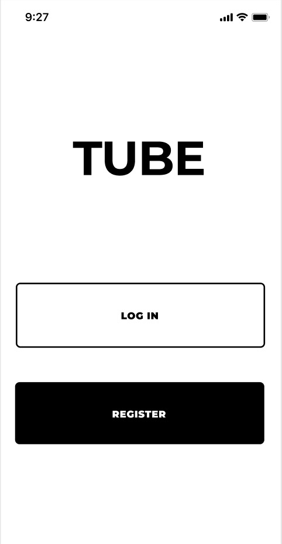

# Tube

This is the official repository of Tube, a mobile tutoring application supporting both iOS and Android. Tube is meant to simplify the tutoring process: to seamlessly connects users and tutors on a university campus. We utilized Google Firebase for the backing database and subsequently implemented a Messaging API in order to allow users and tutors to connect in a matter of minutes.
# Screenshots

  
  

  
  

  
  

